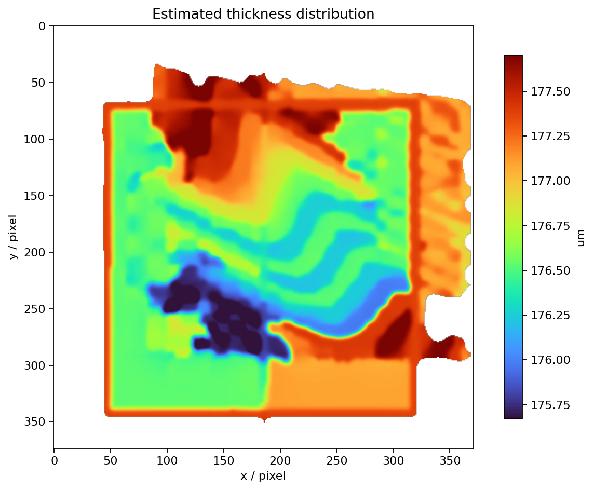
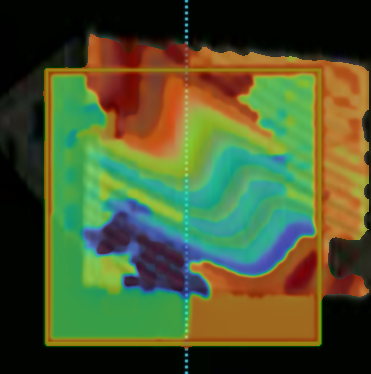
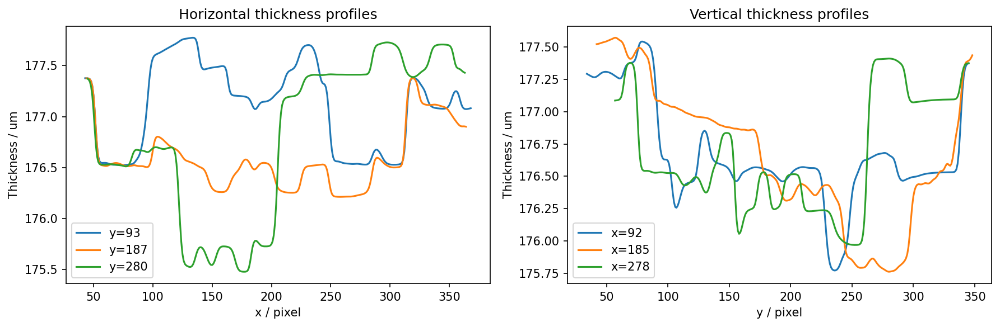
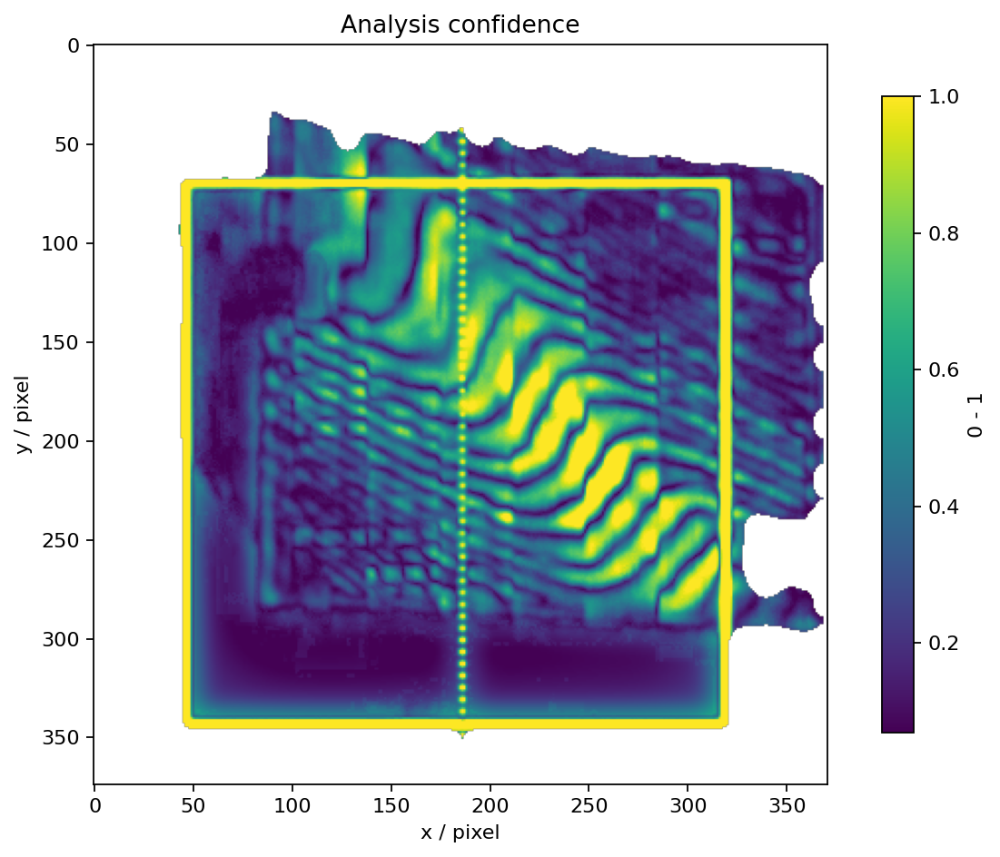

# 彩色薄膜干涉图厚度分布分析报告

## 1. 输入与方法

- 输入图像：`example_input.jpg`
- 分析模式：单图彩色条纹级次插值
- 输出量：近似绝对厚度
- 有效波长：589.3 nm
- 薄膜折射率：1.5230
- 有效分析像素：90132

程序先分割亮的薄膜区域，排除大部分黑色背景；再利用 Lab 色彩空间中的循环色彩坐标恢复连续条纹级次。默认模式假设一个完整颜色周期对应一个有效干涉级次，其厚度步长为

$$
\Delta t=\frac{\lambda_{eff}}{2(n-1)}.
$$

若使用颜色标定 CSV，程序将像素颜色匹配到已经基准扣除的实际光程差，再按

$$
t=\frac{\Delta OPD}{2(n-1)}
$$

换算厚度。

## 2. 结果

| 指标 | 数值 |
|---|---:|
| 稳健最小值（2%分位） | 175.6721 μm |
| 稳健最大值（98%分位） | 177.7011 μm |
| 稳健峰谷值 PV | 2.0290 μm |
| RMS 不均匀度 | 0.4627 μm |
| 中间 90% 厚度跨度 | 1.6481 μm |
| 中位置信度 | 0.301 |
| 中位厚度梯度 | 0.01405 μm/pixel |
| 95%厚度梯度 | 0.14257 μm/pixel |

## 3. 图像现象分析

- 条纹明显弯曲且局部间距变化，说明薄膜厚度梯度的方向和大小随位置变化，不符合均匀平行薄膜模型。
- 条纹密集区域对应较大的相位/厚度梯度；条纹疏松区域对应较平缓的厚度变化。
- 高梯度且低置信度的位置可能来自薄膜真实突变，也可能来自样品边缘、反光、遮挡或条纹断裂，需要结合原图复核。
- 厚度图的整体正负方向存在符号约定；若已知哪一侧实际更厚，可使用 `--invert` 反转方向。

## 4. 结果边界

默认单图模式提供的是模型依赖的相对厚度估计，不是可溯源的绝对厚度测量。白光颜色还受到光源光谱、相机 RGB 响应、曝光、白平衡和折射率色散影响。若要用于定量结论，应在相同光源、相机和曝光条件下，采用停车后清晰图像制作 `opd_um,r,g,b` 颜色标定表，并使用无薄膜基准扣除系统原有光程差。
