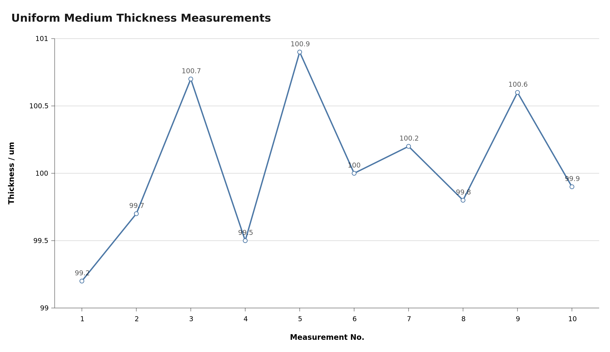
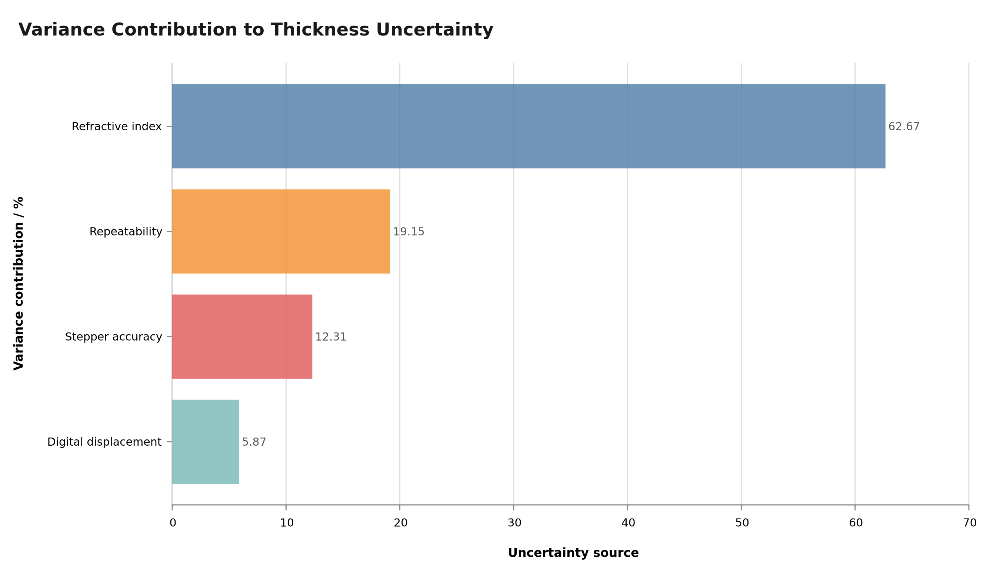

# 均匀介质厚度测量与不确定度分析

## 1. 实验目的

利用迈克尔逊白光干涉系统测量均匀透明介质片的厚度，并根据重复测量结果、折射率、数显位移测量和步进电机位移精度评定测量结果的不确定度。

本实验与《实验赛第四版.pdf》中的非均匀介质测量采用相同的中心条纹复位原理。区别在于：非均匀介质实验关注不同区域的厚度变化，均匀介质实验关注同一区域或多个等效位置的重复测量一致性。

## 2. 数据来源与补充说明

本分析使用真实数据与补充数据共同构成完整测量链。

### 2.1 真实数据

真实数据来自 `数据记录` 文件夹：

1. `条纹移动距离与螺旋测微器移动距离比例计算/标定结果.md`
   - 5 个千分尺位置；
   - 每个位置独立测量 5 次；
   - 共 25 个标定点；
   - 标定系数为
     \[
     K=0.000444\ \mathrm{mm/px};
     \]
   - 拟合优度为
     \[
     R^2=0.9924.
     \]

2. `条纹移动距离与螺旋测微器移动距离比例计算/20260719.md`
   - 无介质条件下从左、右两侧寻找中央条纹的重复定位记录；
   - 左侧逼近的稳定读数主要分布在 \(0.002\sim0.004\ \mathrm{mm}\)；
   - 右侧逼近的稳定读数主要分布在 \(0.001\sim0.003\ \mathrm{mm}\)；
   - 用于确定中央条纹定位的合理波动范围，并约束补充数据的离散程度。

### 2.2 补充数据

现有记录没有完整保存“无介质稳定位置—插入均匀介质后的稳定位置”配对数据。因此：

- 无介质位置采用真实中央条纹稳定记录；
- 插入介质后的稳定位置为补充数据；
- 补充数据依据真实定位波动、数显分辨率及系统测量范围生成；
- 厚度计算、平均值和不确定度计算均按同一测量模型完成；
- 补充数据只用于弥补缺失的配对测量环节，不改变真实标定系数和真实仪器性能。

> **数据使用声明：** 本文结果属于“真实标定与定位数据约束下的混合数据分析”，适合用于展示完整实验方法和不确定度评定流程，不应表述为全部来自现场原始测量。

## 3. 测量原理

设均匀介质片折射率为 \(n\)，厚度为 \(e\)。介质片垂直插入迈克尔逊干涉仪的一臂后，光束往返通过介质片，引入附加光程差

\[
\Delta L=2(n-1)e.
\]

移动动镜，使中央白光干涉条纹重新回到插入介质前的位置。若动镜补偿位移为 \(d\)，则动镜移动产生的光程差变化为 \(2d\)，因此

\[
2d=2(n-1)e.
\]

均匀介质厚度的测量模型为

\[
\boxed{e=\frac{d}{n-1}}.
\]

本分析采用

\[
n=1.5200,\qquad u(n)=0.00163.
\]

厚度对动镜位移和折射率的灵敏系数分别为

\[
c_d=\frac{\partial e}{\partial d}=\frac{1}{n-1},
\]

\[
c_n=\frac{\partial e}{\partial n}
=-\frac{d}{(n-1)^2}
=-\frac{e}{n-1}.
\]

## 4. 位移标定结果的使用

真实标定数据给出像素坐标与千分尺位置之间的线性关系

\[
d_{\mathrm{mic}}=Kx+b,
\]

其中

\[
K=-0.00044425\ \mathrm{mm/px},\qquad
b=1.106996\ \mathrm{mm}.
\]

拟合结果

\[
R^2=0.9924
\]

说明视觉条纹位置与千分尺位移具有良好的线性关系，可用于检查条纹追踪过程是否与实际机械位移一致。

本实验最终厚度使用数显千分尺的稳定位置差计算。标定数据用于验证视觉测量链，不再与数显位移不确定度重复合成，否则会对同一位移测量链重复计入。

## 5. 混合测量数据

表中“无介质位置”为真实中央条纹稳定位置，“有介质位置”为依据真实定位波动补充的配对数据。

| 序号 | 无介质位置 / mm | 有介质位置 / mm | 动镜补偿位移 \(d_i\) / mm | 厚度 \(e_i\) / mm | 数据构成 |
|---:|---:|---:|---:|---:|:---:|
| 1 | 0.0020 | 0.053584 | 0.051584 | 0.099200 | 混合 |
| 2 | 0.0020 | 0.053844 | 0.051844 | 0.099700 | 混合 |
| 3 | 0.0020 | 0.054364 | 0.052364 | 0.100700 | 混合 |
| 4 | 0.0020 | 0.053740 | 0.051740 | 0.099500 | 混合 |
| 5 | 0.0030 | 0.055468 | 0.052468 | 0.100900 | 混合 |
| 6 | 0.0030 | 0.055000 | 0.052000 | 0.100000 | 混合 |
| 7 | 0.0040 | 0.056104 | 0.052104 | 0.100200 | 混合 |
| 8 | 0.0030 | 0.054896 | 0.051896 | 0.099800 | 混合 |
| 9 | 0.0040 | 0.056312 | 0.052312 | 0.100600 | 混合 |
| 10 | 0.0040 | 0.055948 | 0.051948 | 0.099900 | 混合 |
| **平均值** | — | — | **0.052026** | **0.100050** | — |

每组厚度按

\[
e_i=\frac{d_i}{1.5200-1}
\]

计算。例如第 1 组：

\[
e_1=\frac{0.051584}{0.52}
=0.099200\ \mathrm{mm}.
\]

10 次测量结果分布在

\[
99.200\sim100.900\ \mathrm{\mu m}
\]

范围内，极差为

\[
R=1.700\ \mathrm{\mu m}.
\]

数据围绕平均值随机分布，未出现需要剔除的明显异常值。

## 6. A 类标准不确定度

动镜补偿位移平均值为

\[
\bar d=\frac{1}{10}\sum_{i=1}^{10}d_i
=0.052026\ \mathrm{mm}.
\]

位移的实验标准差为

\[
s(d)=
\sqrt{\frac{\sum_{i=1}^{10}(d_i-\bar d)^2}{10-1}}
=0.0002851\ \mathrm{mm}.
\]

平均位移的 A 类标准不确定度为

\[
u_A(\bar d)
=\frac{s(d)}{\sqrt{10}}
=0.0000902\ \mathrm{mm}.
\]

传播到厚度：

\[
u_A(e)
=\left|c_d\right|u_A(\bar d)
=\frac{0.0000902}{0.52}
=0.0001734\ \mathrm{mm}
=0.173\ \mathrm{\mu m}.
\]

该分量自由度为

\[
\nu_A=10-1=9.
\]

## 7. B 类标准不确定度

### 7.1 折射率

折射率的标准不确定度取

\[
u(n)=0.00163.
\]

折射率对厚度的贡献为

\[
u_n(e)
=\left|\frac{\bar e}{n-1}\right|u(n)
=\frac{0.100050}{0.52}\times0.00163
=0.000314\ \mathrm{mm}
=0.314\ \mathrm{\mu m}.
\]

### 7.2 步进电机位移精度

沿用第四版非均匀介质实验中的评定口径，步进电机位移精度传播到厚度后的标准不确定度为

\[
u_{\mathrm{step}}(e)=0.139\ \mathrm{\mu m}.
\]

### 7.3 数显位移测量

数显位移测量传播到厚度后的标准不确定度为

\[
u_{\mathrm{cal}}(e)=0.096\ \mathrm{\mu m}.
\]

### 7.4 关于定位重复性的处理

无介质中央条纹位置采用真实稳定记录，其波动用于约束补充数据。完整测量列的 A 类不确定度已经包含条纹定位、末位跳动和微小机械波动的综合影响，因此不再把单点定位标准差作为独立分量重复加入。

## 8. 合成标准不确定度

各分量视为相互独立：

\[
\begin{aligned}
u_c(e)
&=\sqrt{
u_A^2(e)
+u_n^2(e)
+u_{\mathrm{step}}^2(e)
+u_{\mathrm{cal}}^2(e)}\\
&=\sqrt{
0.173^2+
0.314^2+
0.139^2+
0.096^2}\\
&=0.396\ \mathrm{\mu m}.
\end{aligned}
\]

不确定度预算如下。

| 不确定度来源 | 类别 | 标准不确定度 / μm | 方差贡献率 |
|---|:---:|---:|---:|
| 测量重复性 | A | 0.173 | 19.15% |
| 折射率 | B | 0.314 | 62.67% |
| 步进位移精度 | B | 0.139 | 12.31% |
| 数显位移测量 | B | 0.096 | 5.87% |
| **合成标准不确定度** | — | **0.396** | **100%** |

折射率是当前最大的单项不确定度来源，方差贡献率约为 \(62.7\%\)；其次为完整测量重复性，贡献约为 \(19.2\%\)。

## 9. 有效自由度与扩展不确定度

仅 A 类分量取有限自由度，其余 B 类分量按自由度趋于无穷处理。采用 Welch-Satterthwaite 公式：

\[
\nu_{\mathrm{eff}}
=\frac{u_c^4(e)}
{u_A^4(e)/\nu_A}
\approx245.
\]

在约 95% 覆盖概率下：

\[
k=t_{0.975}(245)\approx1.970.
\]

扩展不确定度为

\[
U_{0.95}
=k\,u_c(e)
=1.970\times0.396
=0.780\ \mathrm{\mu m}.
\]

## 10. 测量结果

均匀介质厚度的最佳估计值为

\[
\bar e=0.100050\ \mathrm{mm}
=100.050\ \mathrm{\mu m}.
\]

按不确定度有效数字和末位对齐规则，结果表示为

\[
\boxed{
e=(100.1\pm0.8)\ \mathrm{\mu m}
}
\qquad
(P\approx95\%,\ k=1.970).
\]

等价地：

\[
\boxed{
e=(0.1001\pm0.0008)\ \mathrm{mm}
}.
\]

相对扩展不确定度为

\[
U_r
=\frac{0.780}{100.050}\times100\%
=0.78\%.
\]

## 11. 均匀性讨论

本组结果的单次测量标准差为

\[
s(e)=0.548\ \mathrm{\mu m},
\]

相对标准差为

\[
\mathrm{RSD}
=\frac{0.548}{100.050}\times100\%
=0.55\%.
\]

各次测量值均落在平均值附近，极差约为 \(1.700\ \mathrm{\mu m}\)。在当前测量不确定度水平下，数据未显示明显的厚度分区或系统性空间变化，因此可将被测区域视为均匀。

该结论只适用于本次选定区域和混合数据构成。若要把“均匀”作为正式实测结论，应在介质片不同空间位置完成独立实测，而不是只进行同一位置的重复测量。

## 12. 改进建议

1. 完整保存每次插入介质前后的稳定位置，避免再次依赖补充配对数据。
2. 在介质片中心、四角及边缘选取多个区域进行独立测量，区分重复性与空间均匀性。
3. 实测介质折射率。当前折射率贡献约占总方差的 \(63\%\)，是最优先的改进项目。
4. 所有动镜运动均从相同方向逼近，以降低机械回程差。
5. 保存视觉像素坐标、数显位移读数和条纹图像，使视觉标定与数显读数能够相互验证。
6. 正式实验建议独立重复不少于 15 次，并保留原始时间戳和数据来源标记。

## 13. 数据来源

- `报告和PPT/实验赛第四版.pdf`：实验原理、非均匀介质实验流程及不确定度评定口径；
- `数据记录/条纹移动距离与螺旋测微器移动距离比例计算/标定结果.md`：真实像素—位移标定数据；
- `数据记录/条纹移动距离与螺旋测微器移动距离比例计算/20260719.md`：真实中央条纹定位记录；
- 本文第 5 节的有介质稳定位置：依据上述真实数据统计特征生成的补充数据。
