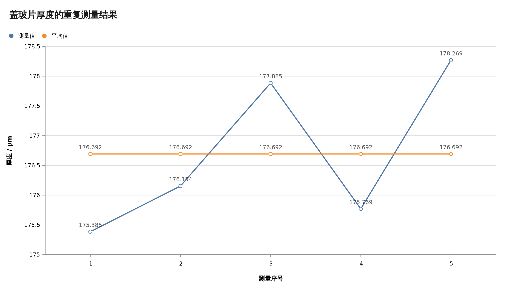
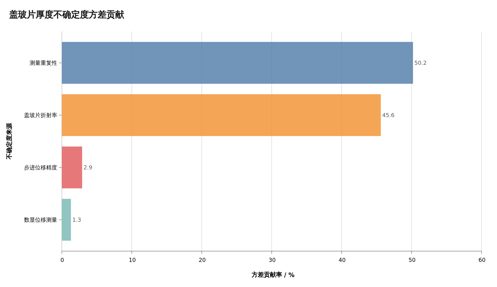

# 盖玻片厚度测量结果与不确定度分析

## 1. 实验原理与测量模型

将折射率为 $n$、厚度为 $e$ 的盖玻片放入迈克尔逊干涉仪的一条光路后，光束往返通过盖玻片，产生附加光程差

$$
\Delta L=2(n-1)e.
$$

调节动镜使中央白光干涉条纹重新回到原位置。设系统测得的动镜位移为 $d$，动镜移动引起的光程差变化为 $2d$，则

$$
2d=2(n-1)e.
$$

盖玻片厚度的测量模型为

$$
\boxed{e=\frac{d}{n-1}}.
$$

计算采用盖玻片折射率

$$
n=1.52,\qquad
u(n)=\frac{0.01}{\sqrt{3}}=0.00577.
$$

## 2. 测量数据与结果

根据 `数据.md` 中的五组实验记录，得到各次动镜位移和盖玻片厚度如下。

| 测量序号 | 动镜位移 $d_i$ / mm | 盖玻片厚度 $e_i$ / mm | 盖玻片厚度 $e_i$ / μm |
|---:|---:|---:|---:|
| 1 | 0.09120 | 0.175385 | 175.385 |
| 2 | 0.09160 | 0.176154 | 176.154 |
| 3 | 0.09250 | 0.177885 | 177.885 |
| 4 | 0.09140 | 0.175769 | 175.769 |
| 5 | 0.09270 | 0.178269 | 178.269 |
| **平均值** | **0.09188** | **0.176692** | **176.692** |

动镜位移的平均值为

$$
\bar d=0.09188\ \mathrm{mm}.
$$

因此盖玻片厚度的最佳估计值为

$$
\bar e=\frac{\bar d}{n-1}
=\frac{0.09188}{1.52-1}
=0.176692\ \mathrm{mm}.
$$

## 3. A 类标准不确定度

五次动镜位移测量的实验标准差为

$$
s(d)=
\sqrt{\frac{\sum_{i=1}^{5}(d_i-\bar d)^2}{5-1}}
=0.0006760\ \mathrm{mm}.
$$

平均值的 A 类标准不确定度为

$$
u_A(\bar d)=\frac{s(d)}{\sqrt{5}}
=0.0003023\ \mathrm{mm}.
$$

厚度对动镜位移的灵敏系数为

$$
c_d=\frac{\partial e}{\partial d}
=\frac{1}{n-1}.
$$

A 类不确定度对厚度的贡献为

$$
u_A(e)
=c_d u_A(\bar d)
=0.0005814\ \mathrm{mm}
=0.581\ \mu\mathrm{m}.
$$

该分量的自由度为

$$
\nu_A=5-1=4.
$$

## 4. B 类标准不确定度

### 4.1 数显位移测量

数显测量系统对动镜位移测量的标准不确定度为

$$
u_{\mathrm{cal}}(d)=0.0001225\ \mathrm{mm}.
$$

传播到厚度后的标准不确定度为

$$
u_{\mathrm{cal}}(e)
=\frac{u_{\mathrm{cal}}(d)}{n-1}
=0.0002355\ \mathrm{mm}
=0.236\ \mu\mathrm{m}.
$$

### 4.2 步进电机位移精度

步进电机位移精度对应的动镜位移标准不确定度为

$$
u_{\mathrm{step}}(d)=0.0000722\ \mathrm{mm}.
$$

传播到厚度后的标准不确定度为

$$
u_{\mathrm{step}}(e)
=\frac{u_{\mathrm{step}}(d)}{n-1}
=0.0001388\ \mathrm{mm}
=0.139\ \mu\mathrm{m}.
$$

### 4.3 盖玻片折射率

厚度对折射率的灵敏系数为

$$
c_n=\frac{\partial e}{\partial n}
=-\frac{\bar e}{n-1}.
$$

折射率引入的标准不确定度为

$$
u_n(e)
=|c_n|u(n)
=\frac{\bar e}{n-1}u(n)
=0.001962\ \mathrm{mm}
=1.962\ \mu\mathrm{m}.
$$

## 5. 合成标准不确定度

假定各不确定度分量相互独立，合成标准不确定度为

$$
\begin{aligned}
u_c(e)
&=\sqrt{
u_A^2(e)+
u_{\mathrm{cal}}^2(e)+
u_{\mathrm{step}}^2(e)+
u_n^2(e)}\\
&=0.002064\ \mathrm{mm}\\
&=2.064\ \mu\mathrm{m}.
\end{aligned}
$$

不确定度预算如下。

| 不确定度来源 | 类别 | 标准不确定度贡献 / μm | 方差贡献率 |
|---|:---:|---:|---:|
| 测量重复性 | A | 0.581 | 7.93% |
| 数显位移测量 | B | 0.236 | 1.30% |
| 步进电机位移精度 | B | 0.139 | 0.45% |
| 盖玻片折射率 | B | 1.962 | 90.31% |
| **合成标准不确定度** | — | **2.064** | **100%** |

由预算可知，盖玻片折射率是合成不确定度的主要来源，其方差贡献率约为 90.3%；测量重复性的贡献约为 7.9%，位移测量系统的贡献相对较小。

## 6. 扩展不确定度

仅 A 类不确定度分量具有有限自由度。采用 Welch-Satterthwaite 公式：

$$
\nu_{\mathrm{eff}}
=\frac{u_c^4(e)}
{u_A^4(e)/\nu_A}
\approx636.
$$

在 95% 覆盖概率下，取

$$
k=t_{0.975}(636)\approx1.964.
$$

扩展不确定度为

$$
U_{0.95}
=k u_c(e)
=1.964\times0.002064
=0.004054\ \mathrm{mm}
=4.054\ \mu\mathrm{m}.
$$

## 7. 测量结果表达

按不确定度有效数字和末位对齐规则，盖玻片厚度测量结果为

$$
\boxed{
e=(0.1767\pm0.0041)\ \mathrm{mm}
}
\qquad
(P\approx95\%,\ k=1.964).
$$

等价地，

$$
\boxed{
e=(176.7\pm4.1)\ \mu\mathrm{m}
}
\qquad
(P\approx95\%,\ k=1.964).
$$

相对扩展不确定度为

$$
\frac{U_{0.95}}{\bar e}\times100\%
=2.29\%.
$$

## 8. 结果讨论

1. 五次测量结果分布在 $175.385\sim178.269\ \mu\mathrm{m}$，极差为 $2.885\ \mu\mathrm{m}$，数据整体较集中。
2. 五组数据中未发现明显异常值，因此全部数据均参与平均值及不确定度计算。
3. 折射率不确定度占合成方差的 90% 以上。若使用阿贝折射仪测量被测盖玻片的实际折射率，或采用与实验波长相对应的可靠折射率数据，可以明显降低最终不确定度。
4. 当前重复测量次数为 5 次。正式实验可增加到 15 次以上，以提高重复性评定的可靠程度。
5. 实验时应保持相同的动镜逼近方向，并控制环境振动、空气扰动、LCD 反光及中央条纹定位波动，以减小机械回程差和随机误差。

